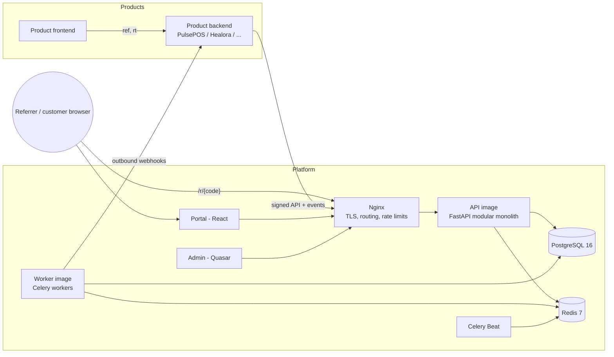
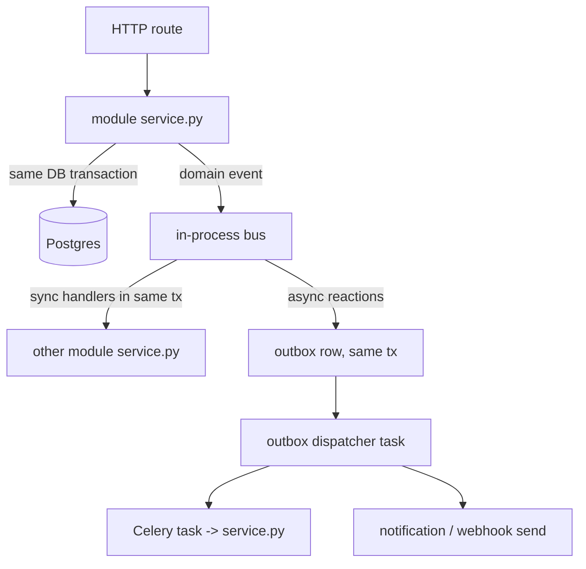
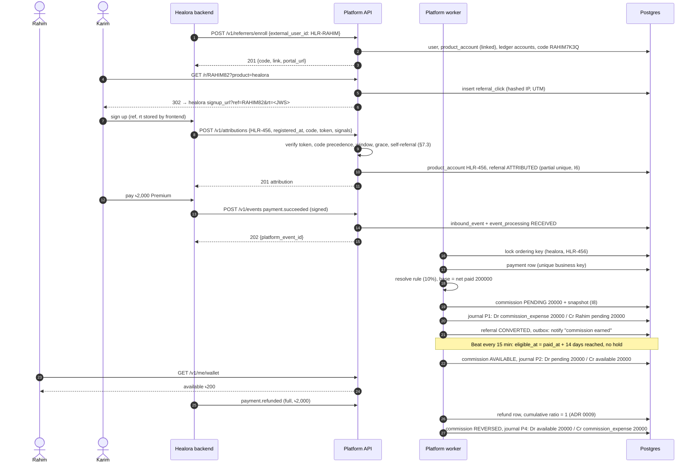
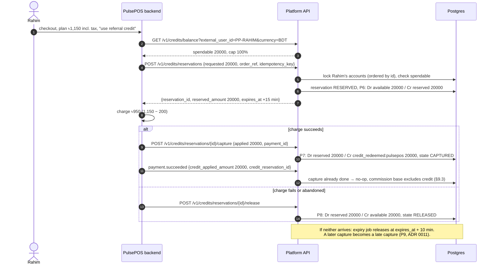
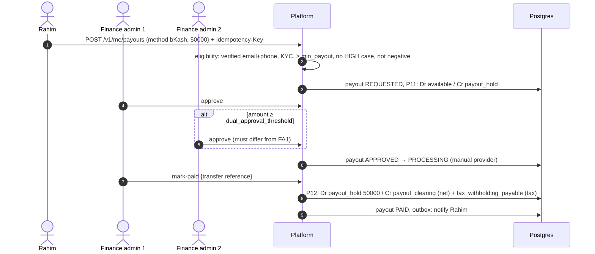
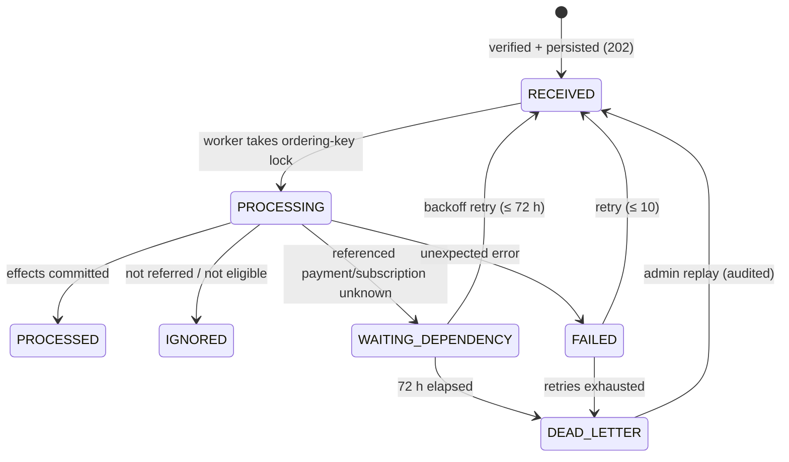

# Architecture

Baseline: [`spec-v2.md`](spec-v2.md). Decisions: [`adr/`](adr/README.md). Data model:
[`erd.md`](erd.md). API: [`openapi.yaml`](openapi.yaml), [`api.md`](api.md). Events:
[`events.md`](events.md). Threats: [`threat-model.md`](threat-model.md).

## 1. Deployment view

- One API image, one worker image (same codebase, different entrypoint). Beat runs from
  the worker image with a single replica.
- Redis: Celery broker, rate-limit buckets, short-lived caches. **Never** a source of
  truth for money; losing Redis loses no financial state (outbox rows in Postgres are
  re-dispatched).

## 2. Request and event processing inside the monolith

- A module calls another only through `service.py` (§3). An import-linter contract in CI
  enforces it.
- Domain events with a **synchronous** handler run inside the publishing transaction
  (e.g. `PaymentRecorded` → commissions creates a commission → ledger posts P1).
  Everything else goes through the outbox, written in the same transaction.
- Inbound events: `POST /v1/events` only verifies, validates, and inserts
  `inbound_events` + `event_processing` + payload (target p95 < 200 ms). A
  `process_event` task does the work under the ordering-key advisory lock (ADR 0012).

## 3. Acceptance A: earn and reverse (Phase 5 exit, ADR 0004)

### Worked ledger for Acceptance A (minor units, BDT)

| Step | Txn | Entries | Rahim pending | Rahim available | commission_expense |
|---|---|---|---|---|---|
| Payment | P1 | +20000 `commission_expense`, −20000 `pending` | 20000 | 0 | 20000 |
| Confirm | P2 | +20000 `pending`, −20000 `available` | 0 | 20000 | 20000 |
| Refund | P4 | +20000 `available`, −20000 `commission_expense` | 0 | 0 | 0 |

(Displayed user balances are `−SUM(entries)`, ADR 0007.) Every row sums to zero (I1),
and balances equal the sum of entries (I3).

## 4. Acceptance B: spend as subscription credit (Phase 7 exit)

## 5. Acceptance C: withdrawal (Phase 11 exit)

## 6. Event intake and retry states

## 7. Concurrency rules (summary)

| Concern | Mechanism |
|---|---|
| Duplicate event delivery (I4) | `inbound_events(product_id, event_id)` unique insert; business-key uniques; ledger `idempotency_key` unique |
| Concurrent events for one customer | `pg_advisory_xact_lock(ordering_key)` (ADR 0012) |
| Balance changes (I5) | One DB transaction; `SELECT … FOR UPDATE` on affected `ledger_accounts` rows in ascending id order; balance check after lock |
| Commission state | Row lock on `commissions` + allowed-transition table |
| Celery redelivery | Every task idempotent; tasks take IDs; effects keyed by unique constraints |
| Beat overlap | Jobs take a named advisory lock (`pg_try_advisory_lock`) and skip if held |
