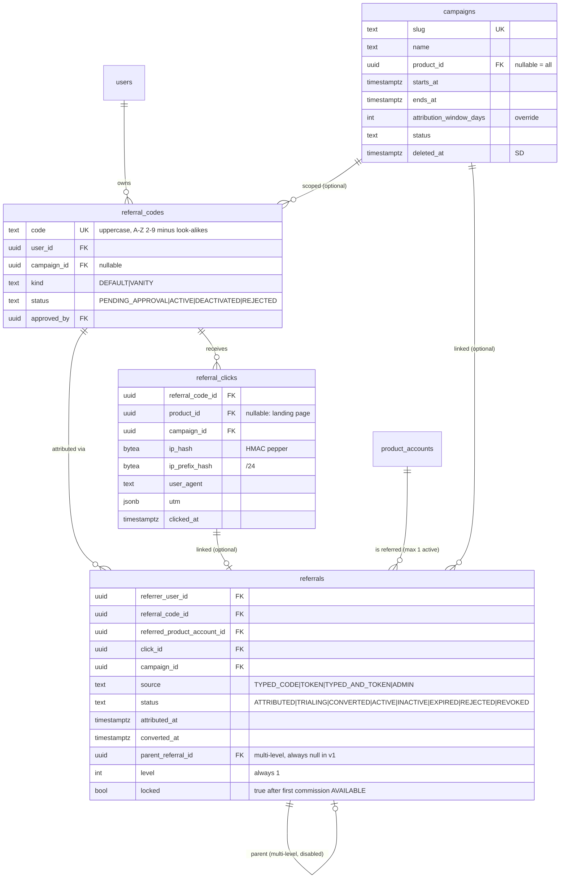
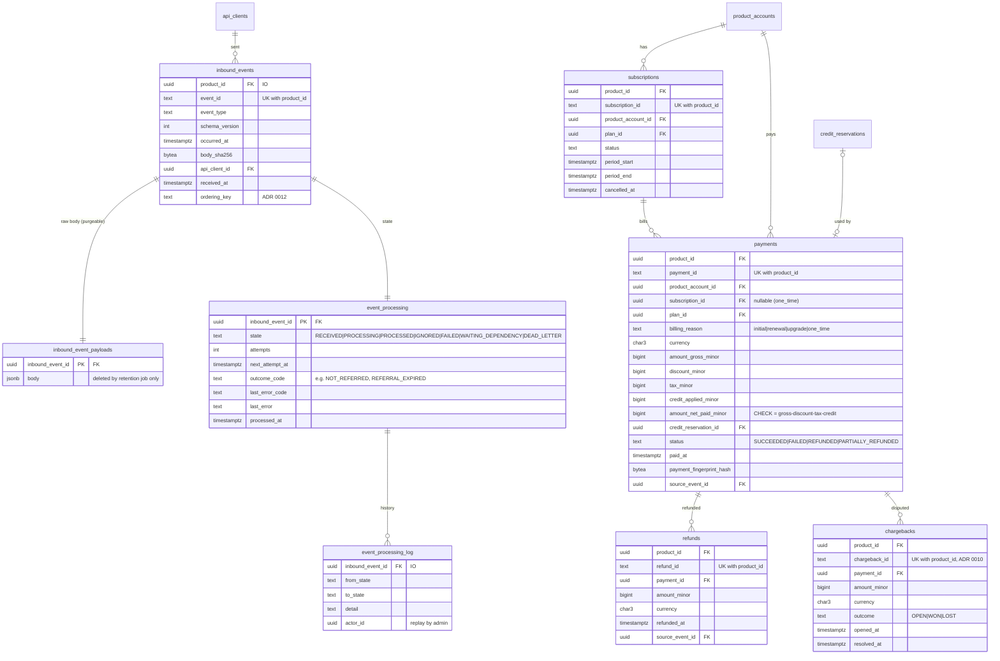
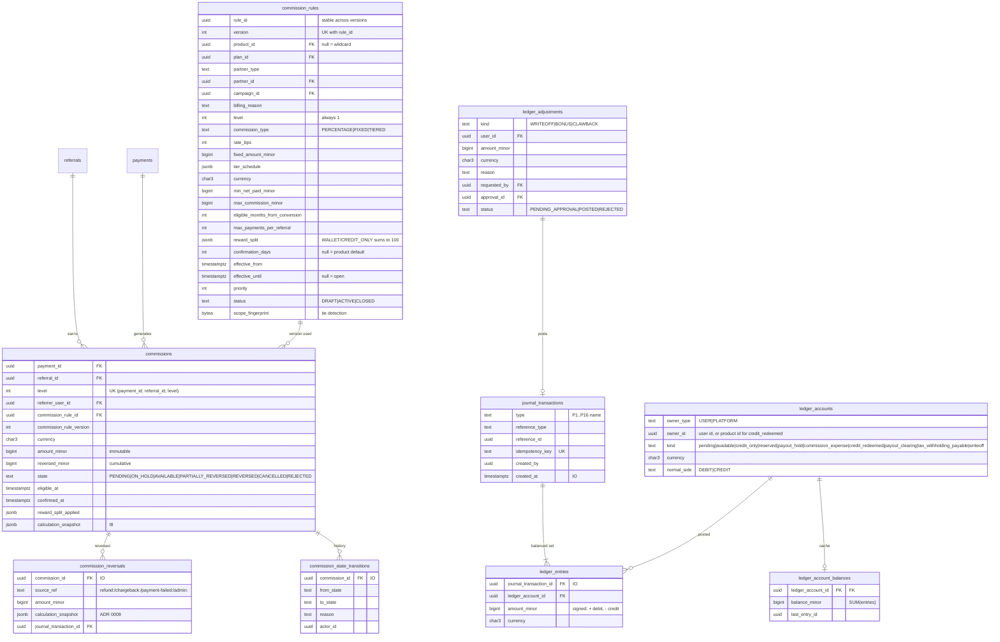
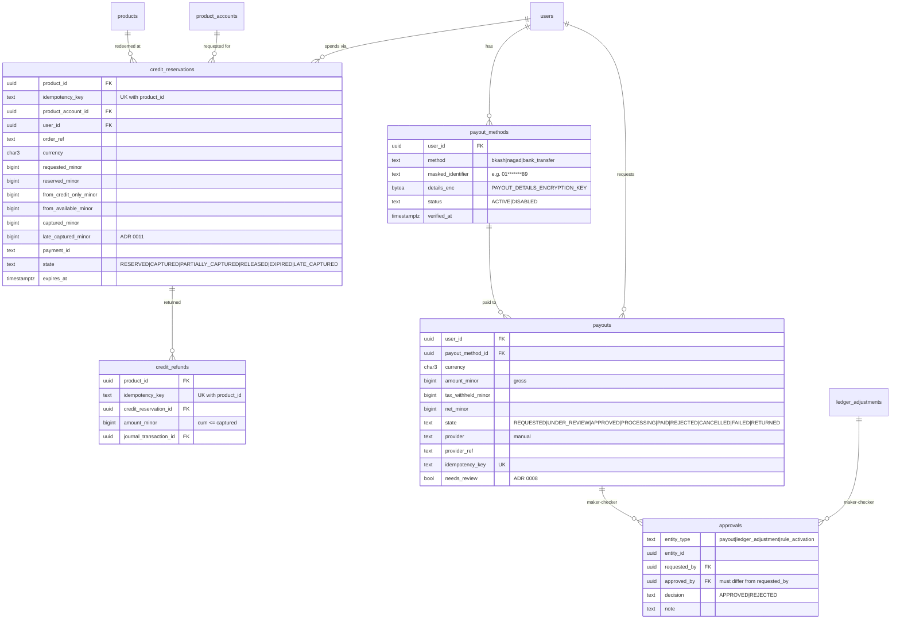

# Entity-Relationship Model

Source of truth for table design (Phase 0 deliverable, §21). Split by module because one
diagram of ~50 tables is unreadable. Conventions:

- Every PK is `id uuid` (UUIDv7, ADR 0003). Omitted from diagrams where obvious.
- Mutable tables have `created_at`, `updated_at` (`timestamptz`, UTC). Insert-only tables
  (ADR 0006, marked **[IO]**) have `created_at` only and a `forbid_mutation` trigger.
- Soft delete (`deleted_at`) only where §21 allows: `users`, `products`, `plans`,
  `campaigns`. Marked **[SD]**.
- Money: `*_minor bigint` + `currency char(3)`. CHECK `currency ~ '^[A-Z]{3}$'`.
- Enums are `text` + CHECK constraint (easier migrations than PG enums).
- Tables added beyond §21 are marked **(+ADR nnnn)** or **(+)** with a reason in §Additions.

## 1. Identity, catalog, partners

```mermaid
erDiagram
    users ||--o{ user_roles : has
    users ||--o{ refresh_tokens : has
    users ||--o{ product_accounts : "linked (optional)"
    users ||--o| partners : "is (optional)"
    users ||--o{ kyc_submissions : submits
    partner_types ||--o{ partners : classifies
    products ||--o{ plans : offers
    products ||--o{ api_clients : "authenticates as"
    api_clients ||--o{ api_client_secrets : "has (max 2 active)"
    products ||--o{ product_accounts : contains
    products ||--o{ auth_handoff_tokens : issues
    product_accounts ||--o{ auth_handoff_tokens : for

    users {
        uuid id PK
        text email "nullable, unique ci where not null"
        bool email_verified
        text phone "E.164, nullable"
        bool phone_verified
        text password_hash "argon2id, nullable"
        text display_name
        text locale "en|bn"
        text time_zone "default Asia/Dhaka"
        text status "ACTIVE|SUSPENDED|PSEUDONYMIZED"
        text kyc_status "NONE|PENDING|VERIFIED|REJECTED"
        text totp_secret_enc "admins, encrypted"
        timestamptz deleted_at "SD"
    }
    user_roles {
        uuid user_id FK
        text role "SUPER_ADMIN|ADMIN|FINANCE_ADMIN|SUPPORT|RISK_ANALYST|PARTNER|CUSTOMER"
        uuid granted_by FK
    }
    refresh_tokens {
        uuid user_id FK
        uuid family_id
        bytea token_hash UK
        uuid replaced_by FK "rotation chain"
        timestamptz expires_at
        timestamptz revoked_at
        text revoke_reason "LOGOUT|ROTATED|REUSE_DETECTED|ADMIN"
    }
    auth_handoff_tokens {
        bytea token_hash UK
        uuid product_id FK
        uuid product_account_id FK
        timestamptz expires_at "60 s"
        timestamptz consumed_at "single use"
    }
    otp_challenges {
        text channel "EMAIL|SMS"
        text destination_hash
        text code_hash
        int attempts
        timestamptz expires_at
        timestamptz consumed_at
    }
    products {
        text slug UK "ADR 0019"
        text name
        text status "ACTIVE|DISABLED"
        text signup_url "registered redirect target"
        text_arr allowed_redirect_hosts
        int attribution_window_days "7|30|60|90"
        int attribution_grace_minutes "ADR 0013, default 1440"
        int conversion_window_days "ADR 0014, default 90"
        int refund_window_days
        int confirmation_days "Q2"
        text referrer_visibility "NONE|MASKED|FULL"
        bool sensitive_category "ADR 0016"
        bool accepts_cross_product_credit
        int credit_max_invoice_pct "default 100"
        bool referral_code_required "Q15"
        jsonb theme "portal theming"
        text outbound_webhook_url
        bytea outbound_signing_secret_enc
        timestamptz deleted_at "SD"
    }
    plans {
        uuid product_id FK
        text plan_code "UK with product_id"
        text name
        text status
        timestamptz deleted_at "SD"
    }
    api_clients {
        uuid product_id FK
        text name
        text key_id UK
        text_arr scopes
        text status "ACTIVE|REVOKED"
    }
    api_client_secrets {
        uuid api_client_id FK
        bytea secret_hash "argon2id/sha256+pepper"
        bytea signing_secret_enc "AES-GCM, SECRETS_ENCRYPTION_KEY"
        text status "ACTIVE|RETIRED"
        timestamptz expires_at
    }
    product_accounts {
        uuid product_id FK
        text external_user_id "UK with product_id"
        uuid user_id FK "nullable; set only via handoff/admin"
        timestamptz registered_at
        bool visibility_consent "for FULL"
        text display_name_masked
        timestamptz first_paid_at
    }
    partner_types {
        text code UK "CUSTOMER|AFFILIATE|AGENCY|RESELLER|..."
        bool requires_approval
        bool requires_kyc
        int tax_withholding_bps "default 0, Q9"
    }
    partners {
        uuid user_id FK "UK"
        uuid partner_type_id FK
        text status "PENDING_APPROVAL|ACTIVE|SUSPENDED|REJECTED"
        uuid approved_by FK
        jsonb agreement "terms version accepted"
    }
    kyc_submissions {
        uuid user_id FK
        text status "PENDING|VERIFIED|REJECTED"
        text document_type
        text storage_ref "encrypted object store key"
        uuid reviewed_by FK
    }
```

## 2. Referrals and campaigns

## 3. Events, subscriptions, payments

## 4. Commissions and ledger

## 5. Credits and payouts

## 6. Risk, notifications, audit, settings, integration

```mermaid
erDiagram
    users ||--o{ risk_signals : "about (optional)"
    product_accounts ||--o{ risk_signals : "about (optional)"
    risk_cases ||--o{ risk_signals : evidence
    users ||--o{ notifications : receives
    notification_templates ||--o{ notifications : renders
    products ||--o{ reconciliation_runs : submits

    risk_signals {
        text kind "EMAIL|PHONE|IP|IP_PREFIX|DEVICE|PAYMENT_FP|CHARGEBACK|..."
        bytea value_hash "HMAC(pepper, normalized value)"
        uuid product_account_id FK
        uuid user_id FK
        uuid source_event_id FK
        timestamptz created_at "IO"
    }
    risk_cases {
        uuid subject_user_id FK
        uuid referral_id FK
        text level "MEDIUM|HIGH|BLOCKED"
        int score
        jsonb reasons
        text status "OPEN|CLEARED|REJECTED|BLOCKED"
        uuid assignee_id FK
        jsonb notes
        uuid decided_by FK
    }
    notification_templates {
        text event_key
        text channel "IN_APP|EMAIL|PUSH"
        text locale "en|bn"
        int version
        text subject
        text body "Jinja2 sandboxed"
        bool active
    }
    notifications {
        uuid user_id FK
        text category
        text channel
        uuid template_id FK
        jsonb context
        text status "QUEUED|SENT|FAILED|READ"
        timestamptz read_at
    }
    outbox {
        text topic "notification|webhook|task"
        jsonb payload
        text dedupe_key UK
        text status "PENDING|DISPATCHED|FAILED|DEAD"
        int attempts
        timestamptz next_attempt_at
    }
    outbound_webhook_deliveries {
        uuid product_id FK
        text event_type
        jsonb payload
        int attempts
        int last_status_code
        text status "PENDING|DELIVERED|DEAD"
    }
    audit_logs {
        uuid actor_id "IO"
        text actor_type "USER|CLI|SYSTEM|API_CLIENT"
        text action
        text entity_type
        uuid entity_id
        jsonb before
        jsonb after
        inet ip
        text request_id
    }
    settings {
        text key
        int version "UK (key, version)"
        jsonb value
        uuid changed_by
        bool active
    }
    reconciliation_runs {
        uuid product_id FK
        date business_date
        int submitted_count
        int missing_count
        int mismatch_count
        jsonb details
    }
```

## Key constraints

From §21, plus additions:

| Constraint | Purpose |
|---|---|
| `referral_codes(code)` UNIQUE | codes never reused |
| `product_accounts(product_id, external_user_id)` UNIQUE | identity |
| `referrals(referred_product_account_id)` partial UNIQUE `WHERE status NOT IN ('EXPIRED','REJECTED','REVOKED')` | I6 |
| `inbound_events(product_id, event_id)` UNIQUE | I4 |
| `payments(product_id, payment_id)`, `refunds(product_id, refund_id)`, `chargebacks(product_id, chargeback_id)` UNIQUE | business-key idempotency |
| `commissions(payment_id, referral_id, level)` UNIQUE | one commission per payment/referral |
| `journal_transactions(idempotency_key)` UNIQUE | exactly-once postings |
| `ledger_accounts(owner_type, owner_id, kind, currency)` UNIQUE | one account per kind |
| `credit_reservations(product_id, idempotency_key)`, `credit_refunds(product_id, idempotency_key)` UNIQUE | idempotent credit ops |
| `commission_rules(rule_id, version)` UNIQUE; exclusion constraint on `(scope_fingerprint, priority, tstzrange(effective_from, effective_until))` for ACTIVE rows | rules cannot tie (§9.2.3) |
| `approvals`: CHECK `approved_by <> requested_by` | maker-checker |
| `payments`: CHECK `amount_net_paid_minor = gross − discount − tax − credit_applied` and all `>= 0` | consistent amounts |
| `commissions`: CHECK `0 <= reversed_minor <= amount_minor` | reversals capped |
| `credit_reservations`: CHECK `reserved = from_credit_only + from_available`, `captured <= reserved` | I5 at row level |
| `ledger_entries`: deferred constraint trigger, per-transaction sum per currency = 0 | I1 |
| Insert-only trigger on all **[IO]** tables | I2 |

## Additions beyond §21

| Table | Why |
|---|---|
| `auth_handoff_tokens`, `otp_challenges` | single-use SSO handoff (§5.3) and OTP login need storage |
| `kyc_submissions` | KYC upload (§18) and KYC eligibility (§13) |
| `chargebacks` | ADR 0010 |
| `commission_state_transitions` | ADR 0006 (history of a mutable state) |
| `inbound_event_payloads`, `event_processing`, `event_processing_log` | ADR 0006 |
| `ledger_adjustments` | P15/P16 records with approvals (ADR 0007) |
| `credit_refunds` | §12 credit refund idempotency |
| `approvals` | replaces `payout_approvals` with one maker-checker table for payouts, adjustments and rule activation |
| `outbound_webhook_deliveries` | replaces `outbound_webhooks`; webhook URL and secret live on `products` |
| `reconciliation_runs` | ADR 0017 |
