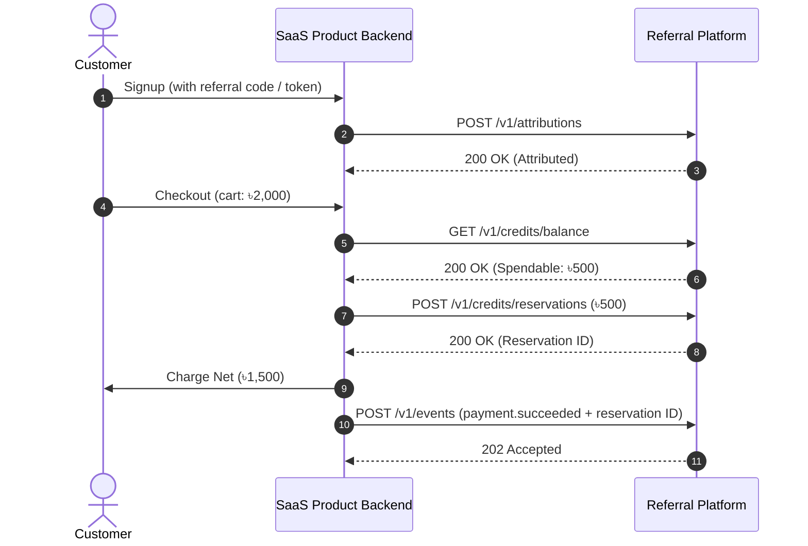

# Product Integration Guide & Generic Contract

This document guides engineering teams connecting a SaaS product to the Centralized Referral & Commission Platform.

---

## 1. Architecture Overview

Connected products interact with the platform via:
1. **Attribution (`POST /v1/attributions`)**: Call on user registration with the referral code or attribution token.
2. **Inbound Events (`POST /v1/events`)**: Asynchronously notify the platform about user signups, subscriptions, payments, refunds, and chargebacks.
3. **Credit Management (`/v1/credits/*`)**: Query spendable balance, reserve credit for checkout, capture or release.

---

## 2. Authentication & Signatures

Every API request requires:
- **API Client Key & Secret**: Sent via `Authorization: Bearer <key_id>.<secret>` or `X-API-Key` & `X-API-Secret`.
- **Event Intake Signatures**: `POST /v1/events` requires an HMAC-SHA256 signature in headers:
  - `X-Signature-Timestamp`: Unix timestamp in seconds.
  - `X-Signature`: `v1=<hex HMAC-SHA256(signing_secret, timestamp + "." + raw_body)>`.

---

## 3. Fail-Soft Principles

- **Registration Paths**: Attribution calls should always fail-soft (`fail_soft=True` in SDK). If the referral platform is temporarily unreachable, customer signup must **never** be blocked.
- **Async Events**: Events are processed asynchronously with at-least-once delivery and strict idempotency on `(product_id, event_id)`.

---

## 4. Integration Checklist

- [ ] Obtain API client credentials (`key_id`, `secret`, `signing_secret`) from Admin.
- [ ] Configure browser helper to capture `ref` / `rt` query parameters on signup pages.
- [ ] Integrate `POST /v1/attributions` into the signup registration handler.
- [ ] Implement credit reservation and balance check in the checkout flow.
- [ ] Emit `payment.succeeded`, `payment.refunded`, and subscription lifecycle events.
- [ ] Run test scenarios against `tools/product-simulator`.
